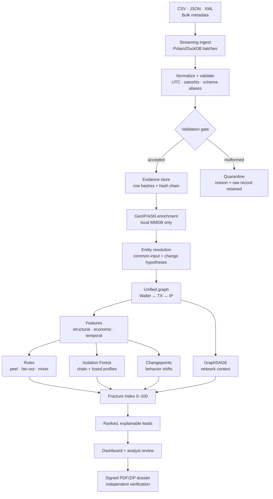
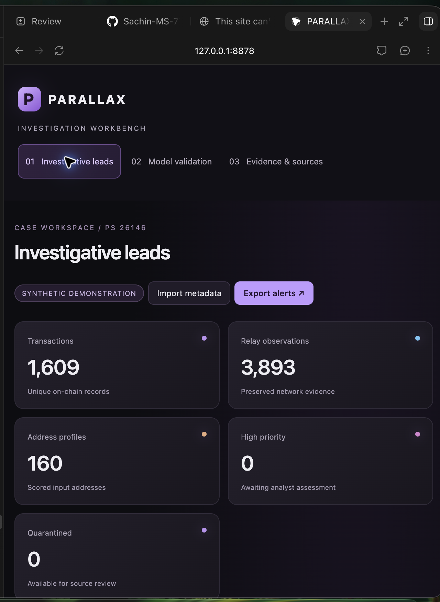
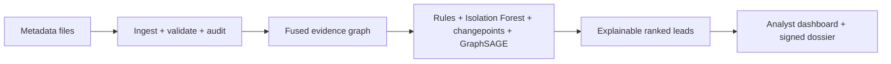

# PARALLAX · Offline Bitcoin Investigation Workbench

> **CSV / JSON / XML → evidence-preserving fusion → explainable leads**


PARALLAX is an offline investigation aid for NTRO Problem Statement 26146. It
joins blockchain-layer activity with network-layer observations so an analyst
can move from a ranked lead to the exact transactions, relay observations,
rules, model contributions, and integrity trail behind it.

The implementation deliberately separates three concepts:

* `priority` is a triage score, not a probability of crime;
* `evidence_quality` describes how complete the supporting observations are;
* network edges are labelled `observed_relay_only` and never claim that an IP owns a wallet.

## Why it is different

| Design choice | Investigator value |
|---|---|
| **One fused graph** | Wallets, transactions, and observed IPs are explored together, with blockchain-only, network-only, and fused views. |
| **Evidence before scoring** | Source files, normalized rows, row hashes, and a hash-chained audit log are retained before any model runs. |
| **Rules + ML + graph context** | Deterministic laundering signatures, Isolation Forest anomaly ranking, changepoints, and GraphSAGE context complement each other. |
| **Explainability by construction** | Every lead can show rule-hit TXIDs, SHAP contributions, score components, supporting paths, and uncertainty. |
| **Adversarial validation** | Peel chains, fan-out, mixer hops, and timing jitter mutate across rounds so evasion failures are visible. |
| **Human feedback loop** | Explicit false-positive dismissals update the configured Fracture weights, invalidate stale evaluation, and preserve the decision in the audit trail. |
| **Offline and reproducible** | After installation, analysis makes no external network calls; signed dossiers can be checked by a standalone verifier. |

## The working pipeline



The important boundary is the validation gate: malformed records are never
silently discarded, and the model cannot erase the evidence that produced a
lead. The score is a triage priority, not a probability of criminality.

## Dashboard tour

Start the local dashboard with `parallax serve`. The overview shows observed
traffic, priority bands, held-out comparison metrics, and the current data
quality state. Selecting a lead opens the investigation view:

1. **Lead summary** — Fracture score, confidence band, evidence completeness,
   and plain-language reason.
2. **Connected evidence** — switch between blockchain-only, network-only, and
   fused graph layers; inspect the supporting path and observed relay edges.
3. **Explainability** — SHAP contributions, deterministic rule hits with TXIDs,
   taint haircut context, endpoint candidates, and temporal drift.
4. **Analyst review** — record a reasoned decision; a confirmed false positive
   updates weights and forces a fresh evaluation.
5. **Evidence & export** — verify the source chain and download a signed case
   dossier containing the selected records, graph, scoring snapshot, and PDF.

The optional Streamlit surface exposes the same case in a compact analyst
layout with live evasion attempts, validation metrics, integrity verification,
and dossier download.



The capture is from the local dashboard and uses the synthetic demonstration
case. The validation and evidence views are included alongside it in the
submission artifact folder.

## Architecture

Read the [architecture and full working pipeline](docs/ARCHITECTURE.md) for GitHub-rendered diagrams, component responsibilities, model validation and runtime boundaries.



The [PARALLAX Linux screenshots workflow template](docs/workflows/linux-demo.yml) runs a synthetic demo on Ubuntu and saves dashboard, investigation, validation and evidence screenshots with environment metadata. To enable it, copy it to `.github/workflows/linux-demo.yml` and push using a credential allowed to update workflows. Download its `parallax-linux-demo` artifact from a successful run. These are Linux-hosted browser captures, not screenshots of a Linux desktop. The template has not yet run; the current publishing credential lacks workflow permission.

## Quick start

Use Python 3.12 on macOS or Linux (Python 3.11+ is declared supported). The dependency set is fully local at runtime; GeoIP files are optional and are never downloaded by PARALLAX.

See [installation and teammate handoff](docs/INSTALLATION.md), the [two-minute presentation script](docs/DEMO_SCRIPT.md), and the [honest feature-status checklist](docs/FEATURE_STATUS.md). The dashboard styling is inspired by [Musemind's Fortexa design](https://www.behance.net/gallery/226315823/Cybersecurity-SaaS-Dashboard-Application); all interface code and charts are implemented locally, with no copied design assets.

For the standalone submission narrative, read the [technical write-up](docs/TECHNICAL_WRITEUP.md) or download the rendered [technical write-up PDF](submission/2026-09-25/PARALLAX-technical-writeup.pdf). Generated dashboard captures are available in [`submission/2026-09-25/dashboard-screens/`](submission/2026-09-25/dashboard-screens/): overview, validation metrics, and evidence integrity.

```bash
./scripts/install.sh
source .venv/bin/activate
parallax demo --data data/demo --entities 160
parallax verify-audit --db data/demo/case.sqlite
parallax verify-case data/demo/sample-case.zip --trusted-key data/demo/signer-public-key.txt
parallax serve --data data/demo --port 8765
```

On Linux, `scripts/install.sh` performs a disk-space preflight and installs
with `PIP_NO_CACHE_DIR=1` so the large CPU PyTorch download is not duplicated in
the pip cache. If it stops before printing **Installed PARALLAX**, fix the
reported disk or Python prerequisite and rerun the same command from the
repository root; do not run a `parallax` command from a deleted or different
virtual environment.

Open `http://127.0.0.1:8765`. For the alternate analyst surface, run
`parallax streamlit --data data/demo --port 8501` and open
`http://127.0.0.1:8501`.

For an air-gapped Linux host, prepare wheels on a matching connected machine and transfer the project with `wheelhouse/`:

```bash
./scripts/prepare_offline.sh wheelhouse
# copy this directory and wheelhouse to the offline host
./scripts/install.sh --offline "$PWD/wheelhouse"
source .venv/bin/activate
```

The CPU PyTorch wheel is used on Linux. The optional Dockerfile provides the same dependency installation and runs the test suite; Docker itself is not required for normal offline operation. Check the transferred wheel checksums in `wheelhouse/manifest.json` before installation.

The demo creates disjoint train, calibration, and held-out test splits, then writes `evaluation.json`. The evaluation is synthetic validation only; it must not be reported as operational accuracy.

For a supplied dataset, ingest first and inspect the quarantine count before training:

```bash
parallax ingest input.jsonl --db case.sqlite
parallax train --db case.sqlite --out model --graph-labels labels.json
parallax score --db case.sqlite --model model
```

The supplied PS26146 generator data has an explicit adapter for its aggregate
multi-input amounts and a few satoshi-rounding discrepancies. It preserves the
original source hash and writes a repair manifest before strict ingestion:

```bash
python scripts/normalize_dataset.py parallax_dataset.json \
  --out data/normalized.json --manifest data/normalization.json
parallax ingest data/normalized.json --db data/case.sqlite
```

If an operator chooses to retain a source's inconsistent fee field, use
`--allow-fee-mismatch`; the computed input-minus-output fee remains authoritative
and every discrepancy is written to the audit chain.

Inspect files before import. A PDF, including a project brief or a Drive preview, is rejected explicitly:

```bash
parallax inspect input.csv
```

Optional enrichment is explicit and offline:

```bash
parallax ingest input.jsonl --db case.sqlite \
  --country-db GeoLite2-Country.mmdb --asn-db GeoLite2-ASN.mmdb \
  --tor-snapshot tor-exits.json --max-gap-seconds 86400
```

Seed addresses must be independently sourced and documented. They are evidence inputs, never labels inferred by PARALLAX:

```bash
parallax seeds --db case.sqlite --file seeds.json
parallax score --db case.sqlite --model model
```

Supported input formats are CSV, JSON, JSONL/NDJSON, and XML. Monetary values are parsed as integer satoshis and are rejected if the transaction is internally inconsistent. Every accepted row is archived, hashed, and linked to an append-only audit chain; malformed rows are quarantined rather than silently dropped.

## What is implemented

The required model is an Isolation Forest over chain and network metadata features. A chain-only baseline is retained so the benefit of adding network evidence can be measured. A two-layer GraphSAGE classifier is trained only when explicit training labels are supplied; its weights are frozen for inference. K-means groups are for navigation only. Tree SHAP explains Isolation Forest path length and is displayed alongside deterministic rule evidence; it is not a causal or ownership explanation.

The dashboard is localhost-only and includes layer-specific interactive graph views, ranked alerts, alert evidence, analyst review states, source/schema review, and case-dossier export. Case dossiers contain source hashes, normalized records, a signed JSON manifest, a print-ready PDF, a detached PDF signature, and an Ed25519 signature. Verification checks both the archive and the separately retained public key.

The upgraded analyst surface adds an operational-readiness command center, a
review-before-import intake gate with field and SHA-256 preview, a temporal
graph slider, clickable edge provenance, chain-only versus fused
counterfactual scores, competing entity hypotheses, an uncertainty panel, a
technique-filtered red-team lab, and a visible evidence-integrity badge. These
are presentation aids over the same offline evidence store; they do not infer
ownership or turn a priority score into a probability of crime.

Adaptive and external-pattern checks are available for development:

```bash
parallax stress-test --model data/demo/model --out data/stress-run
parallax case-replay --model data/demo/model --out data/published-pattern
parallax export-pdf --db data/demo/case.sqlite --address ADDRESS \
  --pdf data/demo/report.pdf --signature data/demo/report.pdf.sig \
  --public-key data/demo/report-public-key.txt
parallax verify-pdf data/demo/report.pdf --signature data/demo/report.pdf.sig --trusted-key data/demo/report-public-key.txt
```

`case-replay` is a synthetic reconstruction of a published DOJ-described laundering pattern. It does not contain real case records or identities. `stress-test` is an adversarial development harness and must not replace a frozen test set.

## Validation and limitations

The synthetic generator creates benign and anomalous scenarios with disjoint input entities and time windows. Evaluation reports Precision@K, precision, recall, false-positive rate, average precision, synthetic calibration and a GraphSAGE comparison where labels are available. The requested Fracture Index uses fixed score bands: Low <=30, Moderate >30 to 60, High >60. The synthetic probability calibrator remains separate from this priority formula. Explicit false-positive dismissals update the configured weights and invalidate the old evaluation. The separate labelled-feedback model reports its probability estimate and holdout Brier score without replacing the Fracture Index. Independent external validation remains necessary.

## Supplied PS26146 data run

The repository includes reviewable evidence from the supplied synthetic dataset.
The original JSON was preserved by hash; its generator-specific aggregate input
amounts and five tiny rounding overflows were repaired in a separate manifest
before strict ingestion. With the supplied local GeoLite2 Country and ASN
databases, the run produced:

| Measure | Result |
|---|---:|
| Transactions accepted | 4,303 |
| Quarantined records | 0 |
| Wallet profiles scored | 6,032 |
| Country database matches | 4,232 |
| ASN database matches | 3,591 |
| Top-20 generator-label positives | 20/20 |

The labels are generator scaffolding for development, not operational truth.
The full artifacts are in [`submission/2026-09-25/`](submission/2026-09-25/),
including the normalization manifest, GeoLite hashes, comparison report, and
independently verified sample dossier.

## Submission working plan

See [the updated feature matrix](docs/FEATURE_STATUS.md) and [measured submission results](docs/SUBMISSION.md). The new implementation includes Polars/DuckDB ingestion batches, ruptures changepoints, chronological proportional haircut exposure, local seed/exchange CSV import, endpoint candidates, the five configured Fracture Index components, evidence-derived notes, cluster dossiers, an independent verifier, and live evasion and false-positive weight updates.

```bash
parallax streamlit --data data/demo --port 8501
parallax adversarial --model data/demo/model --out data/adversarial-run --rounds 3
parallax export-audit --db data/demo/case.sqlite --out data/demo/original-audit.jsonl
python scripts/verify_dossier_standalone.py data/demo/sample-case.zip data/demo/original-audit.jsonl --trusted-key data/demo/signer-public-key.txt
```

Create a single reviewable acceptance bundle after a scored run:

```bash
./scripts/acceptance_bundle.py --data data/demo --out acceptance/demo
```

The bundle contains test and integrity outputs, the audit export, benchmark and
evaluation files, the Git commit, and a manifest. It deliberately excludes the
private signing key.

The standalone verifier imports no application code. It checks signatures, the original log prefix, the signed scoring snapshot, cluster membership and normalized record consistency. Store the trusted key and original audit log separately from the dossier; a bundle that contains its own key and log cannot establish external trust on its own.

Network metadata is observational: relay, NAT, shared hosting, VPN, and Tor can all create plausible alternative explanations. PARALLAX therefore makes zero automated ownership or attribution claims. Missing GeoIP data remains unknown; it is never converted into a suspicious signal. The evidence completeness score reflects network and script coverage, not GeoIP availability or a statistical confidence interval.

The signed dossier supports integrity and reproducibility. It is not a legal admissibility certificate. Any production use needs NTRO authorization, retention rules, access controls, and review under the Bharatiya Sakshya Adhiniyam and applicable policy.
