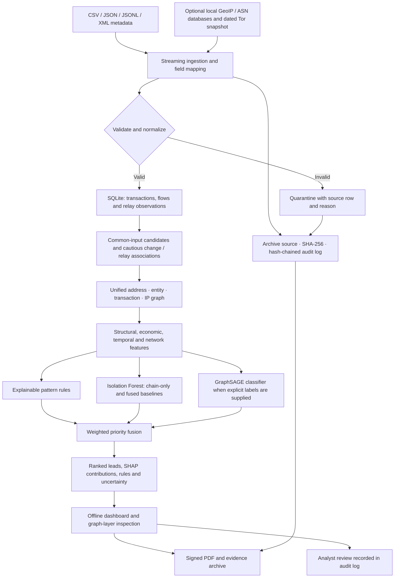
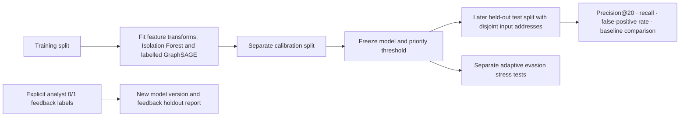

# PARALLAX architecture and working pipeline

PARALLAX is a local Bitcoin metadata investigation workbench for PS 26146. Network observations and blockchain records meet in one evidence graph. The output is a prioritized investigative lead, not an ownership finding or probability of criminality.

## End-to-end data flow

## Model development and evaluation

Synthetic truth labels are separate from transaction metadata. Evaluation rejects overlapping source files, input addresses and invalid time ordering. Synthetic test results characterize these fixtures only. The stress harness is a development tool, not a replacement for a frozen test set.

## Components

| Stage | Code | Responsibility |
|---|---|---|
| Entry points | `parallax/cli.py` | Demo generation, ingestion, training, scoring, evaluation, serving and verification commands |
| Ingestion | `parallax/ingest.py` | Streaming formats, aliases, satoshi precision, UTC timestamps, local enrichment and quarantine |
| Persistence | `parallax/storage.py` | SQLite records, metadata, hashes, audit chain and consistency checks |
| Correlation | `parallax/intelligence.py`, `graph.py` | Candidate entities, weak relay links, pattern context and bounded graph views |
| Features | `parallax/features.py` | Address profiles and chain/network model features |
| Detection | `parallax/model.py`, `graphml.py` | Isolation Forest, GraphSAGE, fusion, calibration and SHAP |
| Validation | `evaluate.py`, `synthetic.py`, `validation.py`, `feedback.py` | Synthetic splits, metrics, adversarial scenarios and explicit feedback fitting |
| Evidence export | `evidence.py`, `pdfreport.py` | PDF/JSON dossiers, signed manifest and detached PDF signature |
| Dashboard | `server.py`, `static/` | Localhost API, local UI assets, filtering, graph views and reviews |

Paths in this table are relative to the `parallax/` package unless fully qualified.

## Runtime and trust boundaries

- The browser talks to a localhost FastAPI server. Analysis uses SQLite and locally stored model artifacts.
- No CDN fonts, remote inference service, telemetry or live Bitcoin interception is required.
- Dependency installation requires connectivity unless a matching offline wheelhouse is prepared first.
- GeoIP databases and Tor snapshots are optional local inputs; their absence remains unknown.
- Network links are observed relay associations. NAT, shared hosting and relays prevent direct ownership inference.
- A signed dossier detects changes when checked against a separately trusted public key. It does not certify legal admissibility.
- Original source data, generated databases and private signing keys are excluded from Git.

## Demonstration sequence

1. Generate the synthetic demo and start the local dashboard.
2. Inspect volumes, priority distribution and the held-out baseline comparison.
3. Select a lead; switch blockchain, network and fused graph layers.
4. Inspect SHAP contributions, rule evidence and uncertainty.
5. Record an analyst decision, verify source/audit integrity and export the dossier.

See [installation](INSTALLATION.md), [the timed presentation](DEMO_SCRIPT.md) and [feature status](FEATURE_STATUS.md). Amount-weighted taint, complete cluster-level dossiers and independent real-case validation are not represented as implemented features.
